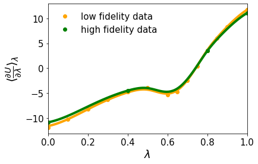
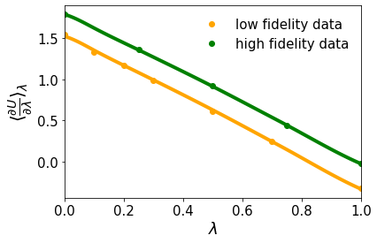
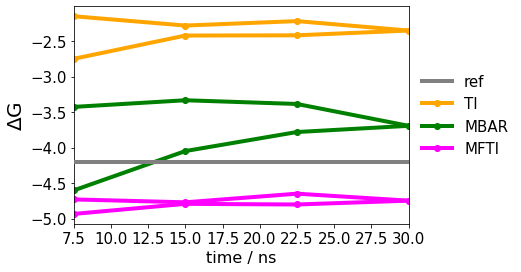

# mult_fidelity_free_energy

Multi-Fidelity Gaussian process integrator based on and for [alchemlyb](https://github.com/alchemistry/alchemlyb).

Allows known patterns to be used to determine free-energy differences with relatively few samples. The integrator learns the pattern from a known or rather cheap reference together with the actual goal. If the patterns match, information can be transferred from the reference to the actual target and used.

Protein mutations serve as an example. The pattern of the same mutation in a tripeptide, which is relatively cheap to simulate, can be used to predict the free energy change of the same mutation in a protein more efficiently.

Since the tripeptide serves as a basis, only the deviation from the tripeptide has to be determined by protein simulations and not the entire lambda pathway in detail.

## Example

Mutation P8A within the PinWW domain from [previous work](https://doi.org/10.1021/acs.jctc.1c01012).

- low fidelity data: mutation P8A in a tripeptide
- high fidelity data: mutation P8A in the PinWW domain

### van-der-Waals interactions:

### Coulomb interactions:

### Results

Free-energy prediction of mutation P8A in the protein.

The Multi-fidelity-TI (MFTI) outperforms a normal TI and is on a par with MBAR. The MBAR result of an 80 ns simulation with significantly narrower lambda sampling serves as a reference. Of course, the approach in the protein cannot reveal anything that has not been sampled. Since the model response is propabilistic, Bayesian optimisation is possible for efficient or improved sampling.